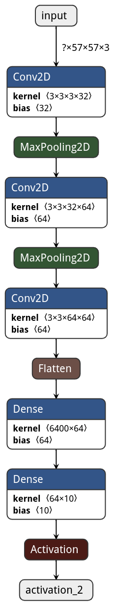

# **AXCNN**
## Table of contents
[Requirements](#requirements)
[Model](#model)
[Dataset](#dataset)

## Requirements
...
pip install -r requirements.txt
...

## Model

## Dataset
Kaggle Dataset [Animals-10](https://www.kaggle.com/alessiocorrado99/animals10)

Put zip file into dataset directory and unizp.
We will get raw-img directory.
...
$python ~/{path to the dir}/preprocessing/split.py
$python ~/{path to the dir}/preprocessing/load.py
...
